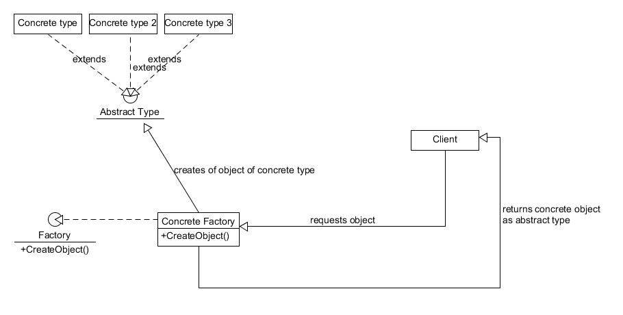

#Simple Factory and Abstract Factory patterns

##1. Simple Factory pattern
+ Intuitive definition: a class responsible for the creation of family of objects
+ Scenario of use: the factory pattern is used with a type hierarchy to facilitate and organize creation of concrete types that implement the same interface/inherit the same class
+ Benefits:
  - reduces coupling to the 'new' operator
  - reduces coupling to concrete types, instead works with interfaces/base classes
  - improves other classes' cohesion by taking the responsibility to create the correct type of object
  - encapsulates object creation logic(also handles internal dependancies)
  - improves modifiability of the creation of objects
  - improves consistency(when you need an object of a type, you use the factory)
  - facilitates the addition of new types

+ [Concrete implementation](./CharacterFactory/CharacterFactory.cs)

+ Diagram:

##2. Abstract Factory pattern
+ Intuitive definition: kind of like a factory for simple factories - encapsulates a family of factories, without specifying their concrete types
+ Scenario of use: when there are multiple simple factories to be managed, or higher abstraction level of object creation is needed
+ Benefits:
  - manages simple factory creation(thus improving the cohesion of the rest of the code)
  - allows to easily switch dependancies
  - reduces coupling by abstracting the simple factories' types

+ [Concrete implementation](./AbstractFactory.cs)

+ Diagram:

##Recap:
Simple factories provide a way to abstract object creation and hide creation logic,
while abstract factories provide an adition layer of abstraction, thus reducing the coupling between the concrete factory types and the rest of the code.