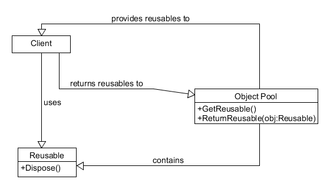

#Object Pool

+ Intuitive definition: a collection of object that are disposed and reused, instead of de-referenced and deleted by the garbage collector/delete operator
+ Scenario of use: when object creation is slow/expensive, or when reusing object provide a simplification over creating new objects
+ Benefits:
	- performance gain
+ Cons:
	- more complex code
	- potential bottleneck when multiple threads try to use objects from the same pool
	- changes the objects' lifetime
	
+ [Concrete implementation(sync)](./CarRenter.cs)

+ Diagram:

